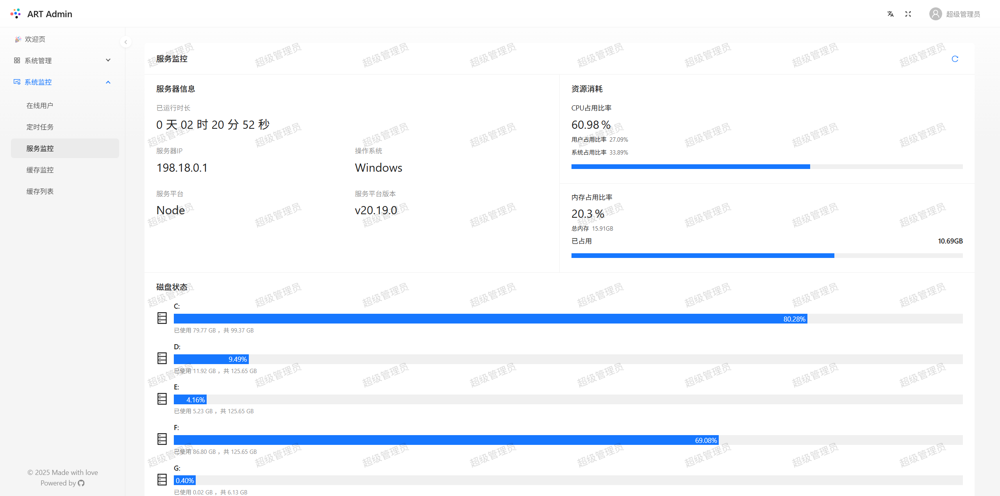
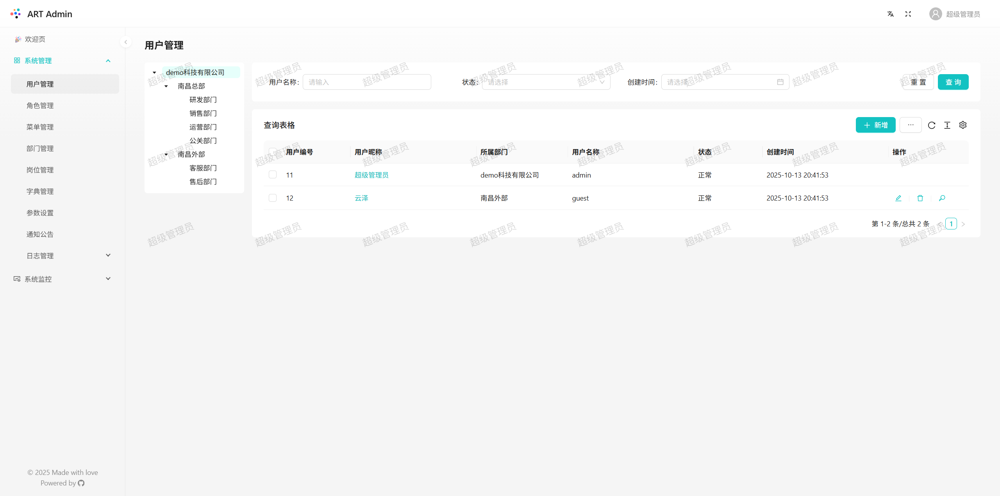

# ART-Admin

> ART-Admin是 **A**nt Design、**R**eact 与 **T**ypeScript 的融合缩写，寓意以 Ant Design 为视觉基石，React 为技术核心，TypeScript 为工程保障，三者协同构建类型安全、可维护性强、现代化的中后台管理系统。





## 📖 简介

**ART-Admin** 是一个功能完备的企业级中后台管理框架，灵感来源于若依（RuoYi）RBAC权限系统，采用前后端分离架构，致力于为开发者提供开箱即用的权限管理、系统监控和配置管理能力。

系统内置丰富的管理模块，涵盖用户、角色、菜单、字典、定时任务、日志审计等核心功能，满足多场景下的企业应用需求。

## 🚀 核心特性

- 🔐 **RBAC 权限控制**：基于角色的访问控制，精细化到按钮级别
- 🧩 **模块化设计**：高内聚低耦合，易于扩展与维护
- ⚡ **懒加载优化**：路由级代码分割 + 组件懒加载，显著提升首屏加载速度与性能
- 🌐 **动态路由**：基于角色权限动态生成前端路由，实现菜单与访问权限自动同步
- 🎨 **主题定制**：支持动态切换 Ant Design 主题（暗色/亮色）
- 🌍 **国际化支持**：内置 i18n 多语言方案（中文、繁体、英文等）
- 📊 **系统监控**：服务状态、缓存信息、在线用户实时展示
- ⏰ **定时任务**：可视化 Cron 任务管理与执行日志
- 📋 **操作审计**：完整记录用户操作日志与登录日志
- 💾 **缓存管理**：Redis 缓存查看与清理功能

## 🧩 内置功能模块

| 模块     | 功能说明                         |
| -------- | -------------------------------- |
| 用户管理 | 用户增删改查、状态控制、密码重置 |
| 部门管理 | 组织架构树形管理                 |
| 岗位管理 | 职位信息维护                     |
| 菜单管理 | 动态路由配置、前端菜单生成       |
| 角色管理 | 权限分配、数据权限设置           |
| 字典管理 | 系统常量字典维护                 |
| 参数管理 | 系统配置参数动态调整             |
| 通知公告 | 站内消息发布与管理               |
| 操作日志 | 记录所有关键操作行为             |
| 登录日志 | 用户登录时间、IP、设备信息追踪   |
| 在线用户 | 实时查看当前登录用户会话         |
| 定时任务 | Cron 表达式任务调度与管理        |
| 服务监控 | CPU、内存、磁盘等运行状态        |
| 缓存监控 | Redis 连接信息与性能指标         |
| 缓存列表 | 查看、刷新、删除缓存项           |

## 🛠 技术栈

| 类别       | 技术选型                   |
| ---------- | -------------------------- |
| 前端框架   | React 18 + TypeScript      |
| UI 组件库  | Ant Design + ProComponents |
| 状态管理   | Zustand                    |
| 工具库     | ahooks                     |
| 后端框架   | Nest.js + TypeScript       |
| 数据库 ORM | Prisma                     |
| 数据库     | MySQL (Prisma 支持)        |
| 构建工具   | Vite                       |
| 样式方案   | css-in-js、ant-style       |
| 国际化     | react-intl                 |
| 接口规范   | RESTful API                |

## 🗂 项目结构

```
    art-admin
    ├── prisma                          #数据库模型和迁移模块
    |   ├── clear.js                    #清空数据库脚本
    |   ├── schema.prisma               #Prisma ORM 模型
    |   └── seed.js                     #seed种子
    ├── static                          #静态文件
    │   └── upload                      #上传文件夹
    ├── src
    │   ├── common
    │   │   ├── class                   #公共返回值包装类
    │   │   ├── contants                #系统常量
    │   │   ├── decorators              #装饰器
    │   │   ├── dto                     #数据模型
    │   │   ├── entities                #公共实体模型
    │   │   ├── enums                   #枚举
    │   │   ├── exceptions              #全局错误拦截器
    │   │   ├── filters                 #全局错误过滤器
    │   │   ├── guards                  #全局守卫
    │   │   ├── interceptors            #装饰器
    │   │   ├── interface               #公共接口
    │   │   └── pipes                   #公共管道
    │   │   └── type                    #公共类型
    │   ├── config
    │   │   ├── config.dev              #开发环境配置文件
    │   │   ├── config.pro              #正式环境配置文件
    │   │   ├── index
    │   ├── modules                     #业务模块文件夹
    │   │   ├── common                  #导入导出和上传模块
    │   │   ├── login                   #登录模块
    │   │   ├── monitor                 #系统监控
    │   │   └── system                  #系统管理
    │   ├── shared
    │   │   ├── prisma                  #数据库连接定义
    │   │   ├── shared.module.ts        #公共模块
    │   │   └── shared.service.ts       #公共方法
    │   ├── app.module.ts
    │   ├── main.ts
    ├── test
    │   ├── app.e2e-spec.ts
    │   └── jest-e2e.json
    │── web                             #前端源码
    │   └── ...
    ├── .eslintrc.js
    ├── .prettierrc
    ├── nest-cli.json
    ├── package.json
    ├── tsconfig.build.json
    ├── tsconfig.json
    └── yarn.lock
```

## ✅ 前期准备

在运行 ART-Admin 项目前，请确保本地环境满足以下依赖要求：

| 环境        | 版本要求          | 说明                               |
| ----------- | ----------------- | ---------------------------------- |
| **Node.js** | `>= 18.x`         | 推荐使用 `20.13.1` 或更高 LTS 版本 |
| **npm**     | `>= 6.14.15`      | 用于依赖安装与脚本执行             |
| **Yarn**    | `>= 1.22`（推荐） | 性能更优，建议优先使用             |
| **MySQL**   | `>= 5.7`          | 支持 MySQL 5.7 及以上版本          |
| **Redis**   | `>= 6.0`          | 用于缓存管理、在线会话存储         |

💡 **建议配置**：

- 使用 [nvm](https://github.com/nvm-sh/nvm) 管理 Node.js 多版本，便于环境切换。
- 安装 Yarn：`npm install -g yarn`
- 设置淘宝镜像以提升依赖下载速度：

  ```bash
  # npm 淘宝镜像
  npm config set registry https://registry.npmmirror.com

  # yarn 淘宝镜像
  yarn config set registry https://registry.npmmirror.com
  ```

## 📦 安装依赖

```bash
# 后端
yarn

# 前端
cd web && yarn
```

## ⚙️ 项目配置

### 1️⃣ 连接 MySQL 🐬

默认数据库连接信息如下：

- **主机地址**：`127.0.0.1:3306`
- **用户名**：`root`
- **密码**：`123456`

> 🔐 **注意**：实际连接配置请以项目根目录下的 `.env` 文件为准，以上仅为开发环境默认值。

### 2️⃣ 连接 Redis 🚀

本项目依赖 Redis 用于缓存、会话管理或消息队列等场景，请确保 Redis 服务已启动并可正常访问。

#### 默认连接配置（开发环境）

- **主机**：`127.0.0.1`
- **端口**：`6379`
- **密码**：无（如需密码，请在配置文件中设置）

> **配置位置**：  
> `src/config/config.dev.ts`（开发环境）  
> `src/config/config.prod.ts`（生产环境）

> 请勿在生产环境使用默认无密码配置。

### 3️⃣ 创建数据库

本项目使用 Prisma ORM，需创建 **主数据库** 和 **影子数据库（Shadow Database）**：

#### ✅ 主数据库（运行时使用）

- **名称**：`art-admin`
- **字符集**：`utf8mb4`
- **排序规则**：`utf8mb4_unicode_ci`

#### 🌫️ 影子数据库（仅开发阶段使用）

- **名称**：建议命名为 `art-admin-shadow`（或其他独立名称）
- **用途**：Prisma Migrate 在开发时用于安全地预演和校验迁移脚本，**必须为空库**
- **字符集与排序规则**：同样使用 `utf8mb4` / `utf8mb4_unicode_ci`

> 💡 **说明**：
>
> - 影子数据库**不会存储真实数据**，仅用于迁移流程中的临时比对。
> - 在 `.env` 文件中需分别配置 `DATABASE_URL`（主库）和 `SHADOW_DATABASE_URL`（影子库）。
> - 生产环境部署时，**无需影子数据库**。

### 4️⃣ 生成 Prisma 客户端

在项目根目录下运行以下命令，基于 `prisma/schema.prisma` 中的模型定义，自动生成类型安全的 Prisma Client：

```bash
yarn db:g
# 或
npm run db:g
```

### 5️⃣ 执行数据库迁移 🔄

在项目根目录下运行以下命令，将 `schema.prisma` 中定义的数据模型同步到数据库，并生成名为 `inte` 的迁移记录：

```bash
yarn db:m
# 或
npm run db:m
```

### 6️⃣ 初始化种子数据 🌱

项目提供了种子（seed）脚本，用于向数据库中写入初始数据（如管理员账号、基础配置等）。

在项目根目录下执行以下命令，运行种子脚本：

```bash
yarn db:seed
```

## 🎮 启动服务

```bash
# 启动后端 (Nest.js)
npm run start:dev

# 启动前端 (Vite)
cd web && npm run dev
```

🔗 访问地址：http://localhost:5173/login

📝 测试账号：

管理员账号：admin / admin123

普通用户账号：guest / guest123

> ⚠️ 温馨提示：
>
> - 生产环境请务必修改默认密码！

## 📄 许可证

本项目基于 MIT License 开源，欢迎自由使用、修改与贡献。

## ❤️ 致谢

感谢以下优秀项目提供的灵感与技术支持：

- [若依 (RuoYi)](https://github.com/YunaiV/ruoyi-vue-pro)
- [meimei-nestjs-admin](https://github.com/87789771/meimei-nestjs-admin)
